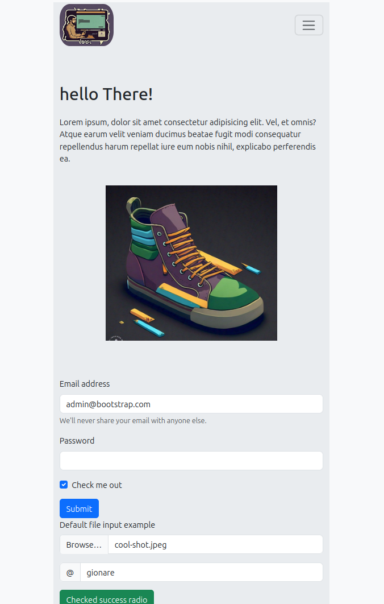
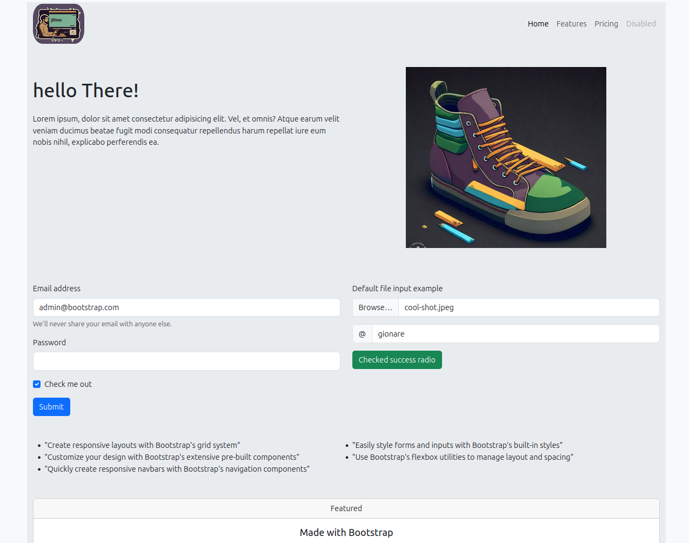

## Landing Page with Bootstrap

- This repository contains a landing page built using Bootstrap, showcasing various features and components of the Bootstrap framework.

# Features and Technologies Used

This project showcases the following features and technologies:

- **HTML**: The structure of the landing page is built using HTML.
- **CSS**: Minimal custom styling has been applied using CSS.
- **Bootstrap**: The landing page heavily utilizes Bootstrap framework for its components and layout.
- **Responsive Design**: The page is designed to be responsive, adapting to different screen sizes and devices.
- **Form Inputs**: Includes form elements styled with Bootstrap's built-in styles.
- **File Upload**: Provides an example of a file input styled with Bootstrap.
- **Radio Buttons**: Demonstrates the usage of Bootstrap's radio button styling.

# How to Run

To view the landing page locally:

- Clone this repository to your local machine.
- Open the index.html file in your web browser.

# Repository Structure

This repository contains the following files and directories:

- `index.html`: The main HTML file containing the structure of the landing page.
- `assets/`: Directory containing images and other assets used in the landing page.
- `README.md`: This file, providing information about the project.

# Credits

    - Bootstrap: A powerful front-end framework for building responsive and customizable websites.
    - Lorem Ipsum: Used for placeholder text in the project.

# Contributing

Contributions are welcome! If you have any ideas, suggestions, or improvements, feel free to open an issue or submit a pull request.

# meta tags

1. Title and Description: Define the title and description of your webpage.

   - <meta property="og:title" content="Your Page Title" />
   - <meta property="og:description" content="Description of your webpage" />

2. URL: Specify the canonical URL of your webpage.

   - <meta property="og:url" content="https://www.yourwebsite.com/page-url" />

3. Site Name: Specify the name of your website.

   - <meta property="og:site_name" content="Your Website Name" />

4. Type: Specify the type of content (e.g., website, article, video).

   - <meta property="og:type" content="website" />

5. Locale: Specify the locale of the content.

   - <meta property="og:locale" content="en_US" />

6. Images: Specify one or more images to be used when sharing.

   - <meta property="og:image" content="image-url.jpg" />
   - <meta property="og:image:width" content="1200" />
   - <meta property="og:image:height" content="630" />

7. Video: If your webpage contains video content, you can specify video-related metadata.

   - <meta property="og:video" content="video-url.mp4" />
   - <meta property="og:video:width" content="1280" />
   - <meta property="og:video:height" content="720" />

8. Article-specific Tags: If your webpage represents an article, you can include additional article-related metadata.

   - <meta property="article:published_time" content="YYYY-MM-DDTHH:MM:SSZ" />
   - <meta property="article:author" content="Author Name" />

## linked in

- To optimize sharing for LinkedIn, you can include specific Open Graph meta tags in your HTML <head> section. Here's how you can do it:

- <meta property="og:title" content="Your Page Title" />
- <meta property="og:description" content="Description of your webpage" />
- <meta property="og:url" content="https://www.yourwebsite.com/page-url" />
- <meta property="og:image" content="image-url.jpg" />
- <meta property="og:image:width" content="1200" />
- <meta property="og:image:height" content="630" />
- <meta property="og:type" content="website" />
- <meta property="og:site_name" content="Your Website Name" />

- <meta property="article:published_time" content="YYYY-MM-DDTHH:MM:SSZ" />
- <meta property="article:author" content="Author Name" />

Description ✍

This is a quirky little HTML document showcasing the usage of Bootstrap for creating a website layout. It's a mix of serious code and a sprinkle of humor 😊

- live URL: https://gionare.github.io/landingpage-boot-straps/

- Github: https://github.com/gionare/landingpage-boot-straps

What's Inside? 📖

- HTML: The backbone of the document, where all the structure is defined.

- CSS: A tad bit of styling to make things look presentable.

- Bootstrap: For making web development a lot less painful and a lot more fun.

- Lorem Ipsum: For providing filler text when creativity decides to take a break, timeless placeholder for the text or maybe just trying to make small talk with a robot at a party." 🤖🎉

Features 📀

- Responsive Design: It can dance to the tune of any screen size!

- Form Inputs: Let's you type in your deepest secrets (well, almost).

- File Upload: Because sometimes you just need to upload your cat pictures.

- Radio Buttons: For those moments when you need to make tough decisions like pizza or tacos. 🍕 🌮

Disclaimer

No cats were harmed in the making of this document.

However, a considerable amount of music where listened. 🎧

## post inspector

- https://www.linkedin.com/post-inspector/
